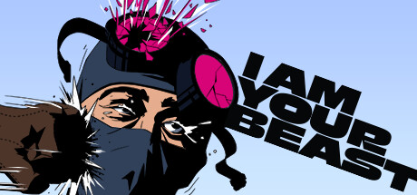

Out of all the games I've played this year [I AM YOUR BEAST](https://store.steampowered.com/app/1876590/I_Am_Your_Beast/) by developer [Strange Scaffold](https://www.strangescaffold.com/) is the game I did not expect to be thinking about the most. Despite playing it right off the heels of [Warhammer 40,000: Space Marine 2](https://store.steampowered.com/app/2183900/Warhammer_40000_Space_Marine_2/), which rightfully has a shot at being the game of year, [I AM YOUR BEAST](https://store.steampowered.com/app/1876590/I_Am_Your_Beast/) has stuck with me more so. Not only from a story standpoint, but from a game design stand point as well.

## Hotline Miami

I'm goint to segway for am moment here to talk about why [Hotline Miami](https://store.steampowered.com/app/219150/Hotline_Miami/) (both one and two) is such a fun time. It blends action, story, and problem solving in an incredibly unique way. Each mission sees the player setting out to complete some objective, which involves going room to room, floor to floor, dispatching bad guys. Which makes it sound like a stock-standard action game. However, by limiting your hit points, and setting a consistent set of rules which is built upon throughout the game, [Hotline Miami](https://store.steampowered.com/app/219150/Hotline_Miami/) turns into almost more a puzzle game. Replaying each level to up your score, dispatch the enemies faster and more efficiently. You spend time optimizing the route through each floor in such a way that the action almost takes a backseat. I'm unware of a game that captured that same magic. There are many 2D top down shooters, but in my gaming career only [Hotline Miami](https://store.steampowered.com/app/219150/Hotline_Miami/) managed to capture that magic of blending action and puzzle solving.

## I AM YOUR BEAST

[I AM YOUR BEAST](https://store.steampowered.com/app/1876590/I_Am_Your_Beast/) captures that same magic as [Hotline Miami](https://store.steampowered.com/app/219150/Hotline_Miami/). The first time you play a misson you feel lost, barely scraping by as your scramble through the missions, haphazardly dispatching enemies, finding the objectives, and finally making it to the end with a middling score. But by the time you finally get that coveted ___S rank___ you have truly come to master the level. Knowing what route to take, which weapons will be best, doing flashier kills to add more time. The "A ha!" moments in the game feel so good, realizing that you can skip entire sections of a level with one well place shot to an exploding barrel, or going up into the snipers nest after you cleared it for the rile to take a shot across the map. The game is a masterclass in level design, and the way it teaches you to play the game is so well done. It's a game that respects the player's time, and rewards them for mastering the game.

Finally the story telling. To be honest [Hotline Miami](https://store.steampowered.com/app/219150/Hotline_Miami/) story always went a bit over my head, but [I AM YOUR BEAST](https://store.steampowered.com/app/1876590/I_Am_Your_Beast/) tells the story through voice logs and converstaions between the main character and the supporting cast. The voice acting does such an incredible job selling the story, and despite the surface level of "We have to bring you back for one more job" ala Rambo, it is surpirsingly deep, thoughtful, and very funny when it wants to be.
